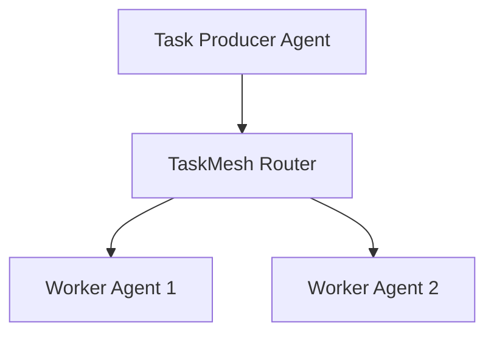

# TaskMesh


TaskMesh is a lightweight task routing layer for AI agents.

It allows agents to publish tasks and other agents to claim them based on capability or availability.

## Quick Start

Clone the repository and run the demo.

```bash
git clone https://github.com/joshuamlamerton/taskmesh
cd taskmesh
python examples/demo.py
```

## Architecture



## What it does

The demo shows:

- a task being submitted
- agents claiming tasks
- the router assigning work

## Repository Structure

```text
taskmesh

README.md
LICENSE

docs
  architecture.md

core
  task_router.py

examples
  demo.py
```

## Roadmap

Phase 1  
Basic task queue

Phase 2  
Capability-based routing

Phase 3  
Priority and retry logic

Phase 4  
Multi-agent coordination features
