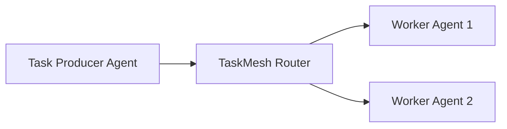

# TaskMesh
================

[](LICENSE)
[](https://www.python.org/)
[](https://github.com/joshuamlamerton/taskmesh/actions)

## Overview
-----------

TaskMesh is a lightweight, open-source task routing layer designed for AI agents. It enables agents to publish tasks and other agents to claim them based on their capabilities or availability.

## Quick Start
-------------

Get started with TaskMesh by cloning the repository and running the demo.

### Installation

```bash
git clone https://github.com/joshuamlamerton/taskmesh
cd taskmesh
```

### Running the Demo

```bash
python examples/demo.py
```

This will launch the demo, showcasing the following features:

* Task submission
* Agent task claiming
* Task assignment by the router

## Architecture
-------------

TaskMesh consists of the following components:

* **Task Producer Agent**: Publishes tasks to the TaskMesh router.
* **TaskMesh Router**: Routes tasks to available worker agents based on their capabilities or availability.
* **Worker Agent**: Claims tasks from the TaskMesh router and performs the assigned work.

The following Mermaid diagram illustrates the architecture:



## Repository Structure
------------------------

The TaskMesh repository is organized as follows:

```markdown
taskmesh
├── README.md
├── LICENSE
├── docs
│   └── architecture.md
├── core
│   └── task_router.py
├── examples
│   └── demo.py
```

## Roadmap
------------

TaskMesh is currently in the experimental phase and is being developed in stages. The following roadmap outlines the planned features and milestones:

### Phase 1: Basic Task Queue

* Implement a basic task queue to store and retrieve tasks.
* Agents can submit and claim tasks from the queue.

### Phase 2: Capability-Based Routing

* Introduce capability-based routing to match tasks with agents that possess the required skills.
* Agents can claim tasks based on their capabilities.

### Phase 3: Priority and Retry Logic

* Implement priority-based task assignment to ensure critical tasks are completed first.
* Introduce retry logic to handle task failures and ensure task completion.

### Phase 4: Multi-Agent Coordination Features

* Develop features to enable multi-agent coordination, such as task delegation and agent collaboration.
* Enhance the TaskMesh router to manage complex task workflows and agent interactions.